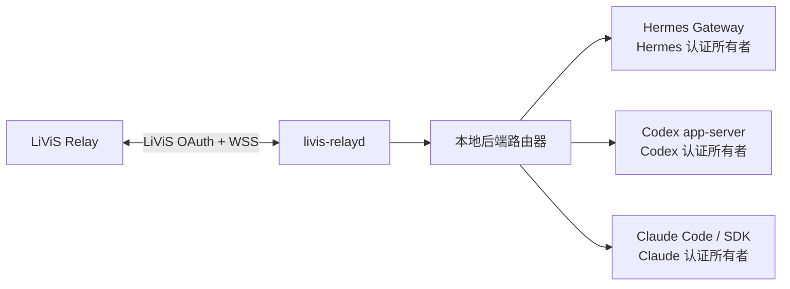

# 本地多后端架构与状态边界

本文定义 `livis-relayd` 调用本机 Hermes、Codex 和 Claude 的当前基线与目标架构。Hermes
connector 已实现；Codex 现在有显式 `native-current` 与 `private-api-key` 两条互斥路径，前者只调用
操作者当前本地 runtime，后者保留 daemon 私有 `CODEX_HOME` 兼容实现。Claude 已实现首版
`native-current` 无状态纯文本路径。原生 adapter 不复用或处理
“认证信息”，而是把本地 backend 的当前状态视为完全不透明：不做账号预检，能启动 transport
就直接调用；具备完整 terminal 证据的执行错误按普通 backend failed 处理，提交后缺少完整 terminal
证据则只按 ambiguous execution 隔离，不能猜测错误是否与账号有关。

## 1. 目标与非目标

目标是让 daemon 只做消息路由、调用和结果持久化，不理解本机原生客户端的账号或凭据状态：

- Hermes 继续使用自己的 profile、Gateway 和 provider 凭据。
- Codex 由 `codex app-server` 或后续审核通过的等价本地接口按本地当前状态执行。
- Claude 由 Claude Code 的稳定非交互接口或官方 SDK 按本地当前状态执行。
- 切换后端只改变路由，不触发登录、注销、token 导入或凭据迁移。
- 本地未登录、账号切换或 provider 错误不构成 daemon readiness 门禁；daemon 仍直接调用。只有
  runtime 给出完整 terminal failure 时才结算普通 Failed；若 spawn 后在安全 init/terminal 前退出，
  仍按提交状态不明进入 Interrupted/quarantine，而不分类成本地认证问题。

非目标：

- 不建立统一的 OpenAI/Anthropic/Hermes 凭据仓库。
- 不把 Codex 或 Claude token 复制到 relay state directory、Hermes profile、SQLite 或配置文件。
- 不允许 LiViS 消息直接指定二进制路径、参数、环境变量或工作目录。
- 不把三个后端的原生 session 文件互相转换或共享。

## 2. 当前实现基线

| 后端 | 调用链 | 当前认证所有权 | 当前状态 |
| --- | --- | --- | --- |
| Hermes | daemon → UDS connector → 专用 Hermes Gateway | Hermes 专用 profile | 已实现；远程输入门禁与 canary 已落地 |
| Codex `native-current` | daemon → 自有 stdio JSON-RPC → `codex app-server` | Codex 当前本地 runtime；对 daemon 不透明 | `operator-only`；已接入 `serve` 并完成真实 LiViS 文本闭环，异常路径/长时并发待验证 |
| Codex `private-api-key` | daemon → stdio JSON-RPC → `codex app-server` | `<stateDir>/backends/codex/home` 中由 Codex 管理的专用 API key | 已实现的旧兼容路径；必须显式选择 |
| Claude `native-current` | daemon → 每 job 独立 CLI `stream-json` 进程组 | Claude Code 当前本地 runtime；对 daemon 不透明 | `operator-only`；纯文本生产接线、离线门禁、原子切换与真实 LiViS 单条文本闭环已完成，异常路径/长跑待验证 |

当前 `execution.backend` 是 daemon 级三选一配置；切换需要停服、排空异 backend 非终态 job
并重启。它不是“同一 daemon 在线同时连接三个后端、每次请求只切路由”的最终形态。

Codex/Claude 现在还可以显式启用同一份 stateDir 外只读 assistant context。长期真源由操作者维护，
workspace 只保存确定性快照；它不改变 backend 认证所有权，也不是原生 session 文件共享。目录、权限、
装配和失败边界见[个人助手上下文与文件记忆](ASSISTANT-CONTEXT.md)。

## 3. 目标进程与状态所有权

| 状态 | 唯一所有者 | daemon 允许的操作 | 失败行为 |
| --- | --- | --- | --- |
| LiViS access/refresh token | `livis-relayd` | 获取、刷新、撤销并以 `0600` 保存 | 终止 LiViS 连接并要求操作者重新登录 |
| connector Bearer 与 lease | `livis-relayd` 和已审核 connector | 本机 IPC 鉴权与执行 fencing | 拒绝连接或迟到结果 |
| Hermes 本地运行状态 | Hermes 原生 runtime | 不读取、不分类，直接调用 | 权威 terminal 为普通 failed；无完整 terminal 则失败关闭 |
| Codex 本地运行状态 | Codex 原生 runtime | 不读取、不分类，直接调用 | 权威 terminal 为普通 failed；无完整 terminal 则失败关闭 |
| Claude 本地运行状态 | Claude Code/SDK | 不读取、不分类，直接调用 | 权威 terminal 为普通 failed；无完整 terminal 则失败关闭 |
| 本地 session/thread ID | 对应 backend adapter | 作为不透明引用保存和回传 | 新建会话或失败关闭 |

LiViS OAuth 与本地推理后端认证是两个独立安全域。backend adapter 不得导入 `IdaasClient`
或 `SecretStore`，daemon 也不得把 LiViS token 交给本地后端。Codex 两种模式必须由操作者显式
选择；私有 `CODEX_HOME` 兼容路径不会因 native initialize/执行失败而自动启用。

## 4. 认证边界与当前门禁强度

daemon 和 backend adapter 必须遵守以下规则：

1. adapter 不读取、解析、复制或监听 Codex、Claude、Hermes 的凭据文件、Keychain 条目或认证环境变量；只允许原生后端进程按其官方机制访问。
2. 不提供 `login`、`logout`、`authenticate`、`getAccessToken` 或 refresh 方法。
3. 不执行原生客户端的登录、注销或 auth 命令。
4. 不通过 argv、环境变量、IPC payload、日志、SQLite 或错误详情传递后端 token。
5. 不调用账号状态接口，不比较主体、登录方式或 provider 认证类型，也不把这些数据写入状态、日志或 SQLite。
6. readiness 只描述 transport：`ready`、`offline` 或 `incompatible`。`ready` 不代表本地执行一定成功。
7. 本地 backend 的权威 terminal error 按普通 failed 结算，不识别“认证不可用”，也不因错误内容
   隔离 session；但提交后没有完整 terminal、协议漂移或进程收口不确定仍必须按执行可证明性隔离。
8. 后端切换不得删除、覆盖或迁移任何后端的现有本地状态。
9. 原生 adapter 记录 backend/transport 版本用于观测和漂移审计，但不能只因版本不同就判定不可用；
   readiness 应由实际 capability/协议握手裁决。只有已经证明某个精确版本存在不可安全兼容的行为时，
   才能增加带测试与证据的定向拒绝规则。

当前代码通过静态声明和源码扫描建立第一层门禁：
[`src/backend/contract.ts`](../src/backend/contract.ts) 公开实现状态、认证集成状态和无凭据的
概念 payload，[`tests/local_backend_contract.test.ts`](../tests/local_backend_contract.test.ts)
检查这些声明；[`tests/auth_boundary.test.ts`](../tests/auth_boundary.test.ts) 扫描
`daemon.ts`、`connector/server.ts`、`src/backend(s)` 和 `src/context`，拒绝已知凭据路径、认证环境变量、
Keychain 读取与登录命令字面量。

这不是完整的运行时强制：`contract.ts` 尚未被生产执行路径导入，源码扫描也不覆盖
`config.ts`、state 等所有数据路径，且不能识别 `process.env` 整体继承之类的间接泄漏。
因此当前门禁只能捕获已枚举的显式越界；在各 adapter 增加专用运行时 guard、环境白名单和
端到端负向测试前，其余边界仍依赖 code review 与实现纪律。不能把测试通过表述为 daemon
已经在运行时强制了全部认证边界。

## 5. 后端中立调用契约

当前 [`src/backend/contract.ts`](../src/backend/contract.ts) 用三类动作表达概念调用面：

- `probe()`：返回实现名称、版本和标准化 readiness。
- `invoke()`：接收 `jobId + leaseId + runGeneration + text + optional session ref`，返回纯文本 final 与本地 session ID。
- `cancel()`：对当前 lease 做 best-effort 取消，不承诺不合作的工具子进程已经退出。

调用 payload 不包含 credential、token、API key、环境变量、命令行或工作目录。二进制路径、固定参数、工作区和资源限制属于操作者审核的本地配置，不来自远端消息。

这里的 `invoke(): Promise<final>` 只是 payload/result 草案，不足以作为生产执行生命周期契约。
生产 adapter 在进入 daemon 前必须映射到现有
[`ExecutionBackend`](../src/backends/execution-backend.ts) 的以下语义：

- dispatch/cancel 返回 `not_sent | submitted`；只有能够证明请求没有离开 daemon 时才允许
  `not_sent`，其余错误一律按已提交或 ambiguous execution 隔离，不能自动重试；
- 独立传递 accepted、唯一 final、failed、cancelled 和 disconnected 事件，不能用一次
  Promise reject 抹平提交后断连；
- 原生当前状态 adapter 不识别 provider 错误是否与账号有关；任意权威 failed 都只原子提交当前
  job 的失败结果并清理 attempt，不设置 `credential_rejected`；
- event handler 只在对应持久化迁移完成后返回，后端 transport 才能 ACK 或释放内存映射。

若未来仍保留 `invoke()` 外形，其稳定错误类型必须显式携带提交状态与 session disposition，
adapter 还必须提供断连事件通道；在这些字段和映射测试落地前，`LocalBackendAdapter` 不能接入
生产派发。当前一期 Hermes UDS WebSocket 协议继续运行，不在本阶段改变；后续 adapter 可以
使用不同本机 transport，但必须保留上述 job、lease、提交可证明性、取消、隔离和唯一 final
语义。

## 6. 路由与会话

- 后端选择来自操作者批准的本地路由配置，不能由未受信任的消息正文隐式改变。
- 同一个 LiViS session 默认固定一个本地后端和原生 session ID。
- 切换后端默认新建原生 session；若要延续上下文，必须由操作者对本次切换或固定路由显式授权，
  才能传递经过长度和内容限制的文本摘要。摘要属于跨后端数据流，不能作为默认能力或静默 fallback。
- 不复制 Codex、Claude 或 Hermes 的原生 session 文件，也不伪造其 session ID。
- 跨 Codex/Claude 共享的只能是操作者显式配置的有界文件 context；它作为同一份文本数据分别发送给
  所选 provider，不赋予跨后端执行权，也不允许 backend 自动写回。
- backend 断开、取消不确定或结果状态不明时，沿用现有 ambiguous execution 隔离，不自动换后端重跑。
- 自动 fallback 必须单独设计和授权；任何本地 backend 错误都不能静默换后端重跑。

## 7. 后续开发计划与门禁

### 7.1 当前收口状态

- Codex 与 Claude 的本地状态不透明声明、执行生命周期、生产 adapter、显式模式路由与原子切换 CLI 已完成；提交可证明性、断连和 ambiguous execution 已映射到 `ExecutionBackend`。Claude 首版刻意使用 stateless-per-job，不宣称原生 session resume。
- 当前只有 `bun run src/index.ts ...` 和 package script，没有安装后可直接调用的稳定 `livis-relay` / `livis-relayd` bin 入口。
- 当前 `main` 使用 `livis-relay-v1-access-only-r2`，本地 S2 门禁已闭合；最终组合 head 的真实 Relay access-only canary 仍是正式启用阻塞项。
- 旧 `worktree-arch-refactor` 的多 connector/outbox pump 原型假设与当前 JobStore v8、ExecutionBackend 和单 backend 失败关闭边界不同，只能作为设计输入，不能直接 cherry-pick。旧 Hermes 0.18.2 / connector v2 / 远程 `/sethome` 路线同样不得进入当前基线。

建议按下面顺序逐块开发，每块独立提交并在精确 staged tree 上运行 `bun run check`。

### 7.2 Gate 0：access-only 最终 head 验收

这项不阻止纯离线 adapter 开发，但阻止当前版本正式启用 LiViS Relay：

1. 在获授权非生产环境完成 `connect(access-only) → connected`；
2. 完成 `token_expiring → IDaaS refresh → token_refresh(access-only) → token_refreshed`；
3. 刷新后完成一条文本 job、结果 ACK 和断线重连；
4. 回执绑定精确 commit、profile/runtime contract SHA 和字段名集合，不保存 token 或生产标识。

失败时保持 r2 fail closed，不恢复发送 refresh token。

### 7.3 阶段 B：Codex 原生当前状态调用

目标是调用本机已经存在的 Codex runtime，同时让账号、登录方式、凭据和 provider 状态对 relay
完全不透明。relay 不做“认证复用”逻辑；本地是什么状态就按什么状态调用。

首个 transport-only 切片已改为：[`codex probe-native-app-server`](./CODEX-NATIVE-AUTH.md) 固定 CLI，
启动 Relay 自己拥有的 `codex app-server --stdio`，只完成 initialize 后关闭。它不读取账号状态、不连接
Desktop control socket，也不会创建 thread；报告始终保持 `productionReady=false`。
该 CLI 现在支持显式 `--command + --state-dir`，只做 Codex transport 检查时不加载 Relay/Hermes
配置、SecretStore 或数据库。

native transport 采用协议优先兼容策略：CLI 与 app-server 版本只要求是有界 semver 并写入报告，
版本不同本身不阻断；stdio initialize 和响应结构才裁决 readiness。2026-07-24 的 transport Gate 已在
CLI/app-server `0.145.0` 上返回 `ready`，自有 app-server 已收口，没有 thread、turn 或账号读取。
随后真实单 turn canary 得到唯一 final `NATIVE_STDIO_CANARY_OK`，job/checkpoint/attempt ledger 全部闭合，
自有 app-server 再次收口。Gate 前后 Desktop daemon 均保持 PID `72289`、app-server `0.144.1` 和原启动
时间，证明主路径没有连接、替换或重启 Desktop。受限沙箱内的 `Operation not permitted` 失败在获授权
环境重跑后消失，不属于版本、协议或本地账号状态错误。

当前 Codex Desktop 及其原生 daemon 是用户拥有的外部系统。relay 只允许 attach 操作者显式配置、
已经存在的本地 runtime 选择器；默认不得连接 Desktop socket。不得启动、停止、重启、替换或升级
Desktop daemon，不得启用或关闭 remote control，也不得修改默认配置或 Desktop session。不兼容时
不能自动回退到私有 API-key 路径。自动化开发只能使用测试拥有的 fake app-server。

第二个纯离线切片
[`CodexNativeExecutionLifecycle`](../src/backends/codex/native-execution-lifecycle.ts) 把预先建立的 stdio
client 映射到 `not_sent | submitted`、accepted、唯一 final、cancel、timeout、disconnect 与
ambiguous execution 语义。本地 backend 的任意 failed 都按普通、脱敏 failed 结算，不识别账号
状态、不设置 `credential_rejected`，也不因此 quarantine session。

第三个切片 [`native thread policy`](../src/backends/codex/native-thread-policy.ts) 固定 workspace、审批、
逐进程 `livis-native-stdio` permission profile、feature、sandbox、memory 和 fresh/resume checkpoint。
子进程 argv 完整覆盖该 profile，只允许 `:minimal` 只读、workspace roots 可写并关闭网络，不修改用户
配置；高风险 feature 同样只在自有子进程内关闭并按协议属性回读。fresh session 接受本地 app-server
实际 model/provider 和有界 instruction-source 路径集合，将其摘要绑定到 session policy；resume 仍按
SQLite 锚点精确比较。Relay 不读取 instruction 内容，也不把 provider 标识解释成账号或认证分类。

第四个切片 [`client epoch fence`](../src/backends/codex/native-client-epoch.ts) 每次 fake stdio attach
只分配递增 epoch，不发 RPC、不保存账号或主体绑定。旧 client 的迟到 notification、exit 和 timeout
不会结算或断开新 client，新 epoch 也不复用旧 active attempt 或 accepted gate。对应
[`epoch 测试`](../tests/codex_native_client_epoch.test.ts) 与
[`生命周期测试`](../tests/codex_native_execution_lifecycle.test.ts) 仍全部使用 fake 端点。

第五个切片 [`native session coordinator`](../src/backends/codex/native-session-coordinator.ts) 已把
epoch、thread policy/checkpoint、JobStore job/lease/run generation 与 lifecycle 组合成纯离线持久
状态机。JobStore schema v8 用 `local-state-opaque` 显式标识这类 session/attempt，相关账号列必须
保持 `NULL`；fresh thread 与初始 checkpoint 在同一 SQLite 事务中绑定，idle 重启只允许精确
resume，历史 active/recovery、metadata/checkpoint 漂移和提交不确定性都进入 ambiguous quarantine。
普通本地 backend failed 只结算当前 job，后续 job 仍可继续调用同一 transport。该状态机及测试不连接
真实 Desktop socket；生产只由显式 `native-current` adapter 接线。

第六个切片 [`native session harness`](../src/backends/codex/native-session-harness.ts) 把可持有连接的
[`attachCodexNativeStdio`](../src/backends/codex/native-stdio.ts) 与 coordinator 接到纯离线受控组合。
notification callback 固定绑定 coordinator 的确切 client epoch；active app-server exit/terminal timeout
进入持久 recovery/quarantine，idle exit 只降低 transport readiness。attach、initialize、preflight
失败都验证 Relay 自有进程的收口语义。对应
[`组合测试`](../tests/codex_native_session_harness.test.ts) 仍只注入 fake stdio client；另行授权的真实
canary 已通过同一 harness 完成一个 turn。生产
[`CodexNativeExecutionBackend`](../src/backends/codex/native-execution-backend.ts) 只在
`codex.mode=native-current` 时建立私有 native workspace、固定 command 并启动该 harness。

原子切换由 `backend switch` 完成：dry-run 只读报告；`--apply` 必须持有 offline/profile guard，
要求 JobStore v8、全 scope 零非终态 backlog、零 account-bound Codex session、零 quarantine，并先写
备份和 PREPARED 收据。配置以 durable atomic replace 提交并读回；错误不触发私有模式 fallback，
收据明确 `credentialsReadOrMigrated=false`。详细命令见
[Codex 原生当前状态边界](CODEX-NATIVE-AUTH.md#1-显式模式与原子切换)。

真实 Gate 已证明执行隔离可由独立 app-server 的逐进程 argv 和逐 thread 回读完成，不需要修改用户
默认配置、重启 Desktop daemon 或关闭 Desktop feature。真实 LiViS 唯一文本 canary 现已完成
`Succeeded → Delivered → App 回显`；但真实 resume、取消、超时、断线、工具执行和长期并发
仍未闭合，因此整项能力继续为 `operator-only`，不能写成全量 `live-canary-verified`。

工作包：

1. transport + 持久 session coordinator 的离线组合和一次真实 fresh turn 已完成；后续真实 resume
   canary 仍必须保持旧 active attempt 先结算或进入 ambiguous quarantine，才允许新 epoch 恢复 thread。
2. 原生模式不读取或持久化 account type、主体、登录状态、token、scope 或 provider 认证分类；现有
   `private-api-key` 兼容路径只能由操作者显式选择，不能自动 fallback。
3. readiness 只描述 transport 的 `ready | offline | incompatible`；本地执行错误不降低 transport
   readiness，也不阻止后续 job 再次调用当前本地状态。
4. fake 端点已覆盖成功、普通 backend failed、超时、取消、app-server 退出、resume 和旧 epoch 迟到
   事件；真实 fresh turn 与 LiViS 文本闭环已通过，真实 resume/异常路径、工具执行与长时
   Desktop 并发仍需另行授权验证。
5. 当前真实 transport 与单 turn Gate 已通过；本地账号状态无论正确或错误都不作为前置门禁，实际
   错误只按普通 execution failed 结算。

完成定义：另行授权的 LiViS 非生产 canary 证明 daemon 未产生第二份后端凭据、未读取账号状态、未改变
Codex Desktop 生命周期或状态、日常 Codex 仍可用，并核对同一 job 的执行、投递和 App 回显全闭合，
才考虑把 `codex_native_auth_reuse` 从 `operator-only` 升级。现有私有路径不能自动 fallback，也不能用 symlink
或文件复制绕过。

### 7.4 阶段 C：Claude adapter

首版已选择 Claude Code `--print --output-format stream-json` 的无状态纯文本路径。它不是把 CLI
自由文本当稳定协议：启动前以 `--version + --help` 检查必需能力，执行期严格验证
`system/init → result` 结构、安全回读与进程组收口。版本只作观察，不设固定窗口。

已完成：

1. 固定绝对 command 并记录观察版本；readiness 由必需安全 flag 与 `stream-json` 事件契约裁决。
2. Claude 本地状态对 daemon 完全不透明：不执行登录、不接收 key、不解析状态文件、不调用账号接口。
3. 建立 `<stateDir>/backends/claude/native-sessions/<hash>` 私有 layout；spawn 环境从空对象按
   HOME、PATH、TMPDIR 和固定 locale/terminal 白名单重建，不整体继承 `process.env`。
4. 固定 `safe-mode`、空 tools/MCP/skills/slash commands、`dontAsk` 与
   `no-session-persistence`，并在 `system/init` 回读中再次验证；plugins/agents 只作为目录校验，
   非空目录不等于可执行能力，实际 tool/hook/user 回注事件仍失败关闭。
5. 把每次真实 `session_id` 映射为 attempt operation ID；job、lease、run generation、提交状态、
   append-only ledger、取消和 disconnect 继续使用 JobStore v8 durable 语义。
6. `backend switch claude`、`doctor` 和 `claude probe-native-cli` 已接入；dry-run/apply SHA 一致，
   收据保持 `credentialsReadOrMigrated=false`。

2026-07-27 的真实 LiViS App 单条文本 canary 已闭合：job
`20260727115354-17875e81-3860-493c-9b4f-7c5185993d00` 为 `Succeeded`，attempt 为
`reserved → accepted → succeeded`，outbox `Delivered` 且仅投递一次，LiViS ACK 与 App 唯一
回显均已确认。当前 `claude_execution` 仍为 `operator-only`；尚未闭合的是本地错误态、
取消/超时/崩溃长跑 canary，以及工具/编码和原生会话恢复。首版明确不提供 resume，因此不能用
“单条命令返回文本”推导会话能力；详细边界、失败现场和运行回执见
[Claude Code 原生当前状态后端](CLAUDE-NATIVE.md)。

### 7.5 阶段 D：稳定本地 CLI 与可观测面

在 adapter 状态字段稳定后提供版本化 `bin` 入口：

- `livis-relay status`、`doctor`、`capabilities`；
- `livis-relay backend list/status`，只显示 implementation、transport readiness、版本和 session affinity；
- `livis-relayd serve` 作为常驻入口，并保持现有 config/profile/guard 语义。

CLI 通过 daemon 管理接口或受 guard 保护的离线只读路径工作，不增加后端 `login/logout` 命令，不输出账号或 token。安装器需要原子替换、版本回读和回滚收据；在此之前继续把 `bun run src/index.ts` 称为开发入口，不能宣称已有稳定 CLI。

### 7.6 阶段 E：在线多后端路由

这是最后一阶段，不与 adapter bring-up 混做：

1. 引入显式 backend registry 和本地 operator-approved route ID；远端消息正文不能选择后端。
2. 新增持久 session affinity 与迁移，job 首次入库仍不可变绑定目标 backend；切换默认新建原生 session。
3. 分离每个 adapter 的 start/ready/stop/recovery，同时保持 JobStore/outbox 只有一个 daemon 所有者。
4. 禁止任何 backend failed 自动 fallback；跨后端重跑必须是单独授权的产品语义。
5. 覆盖一个后端失效不误停其他后端、旧代际迟到事件、daemon 重启、积压迁移、取消与 session release。

完成定义：三后端独立离线/本机 canary、认证存储零改写证明和 LiViS 实网路由 canary 均闭合后，才把 `online_multi_backend_routing` 从 `unsupported` 提升。
