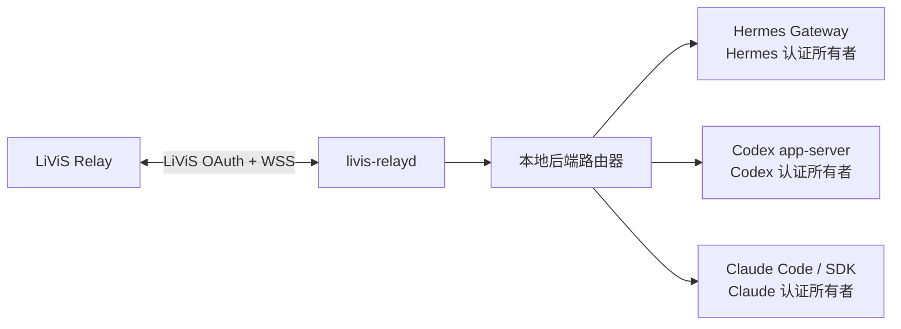

# 本地多后端架构与认证边界

本文定义 `livis-relayd` 调用本机 Hermes、Codex 和 Claude 的当前基线与目标架构。Hermes
connector 已实现；Codex app-server backend 也已实现并取得受控 canary，但当前仍使用 daemon
私有 `CODEX_HOME` 与专用 API key。Claude 才是 `contract-only`。因此“Codex transport 已实现”
与“Codex 已复用用户当前原生认证”必须分开表述，后者尚未完成。

## 1. 目标与非目标

目标是让 daemon 复用本机原生客户端已有的认证状态，只做消息路由、调用和结果持久化：

- Hermes 继续使用自己的 profile、Gateway 和 provider 凭据。
- Codex 由 `codex app-server` 或后续审核通过的等价本地接口执行，并由 Codex 自己持有认证。
- Claude 由 Claude Code 的稳定非交互接口或官方 SDK 执行，并由 Claude Code 自己持有认证。
- 切换后端只改变路由，不触发登录、注销、token 导入或凭据迁移。

非目标：

- 不建立统一的 OpenAI/Anthropic/Hermes 凭据仓库。
- 不把 Codex 或 Claude token 复制到 relay state directory、Hermes profile、SQLite 或配置文件。
- 不允许 LiViS 消息直接指定二进制路径、参数、环境变量或工作目录。
- 不把三个后端的原生 session 文件互相转换或共享。

## 2. 当前实现基线

| 后端 | 调用链 | 当前认证所有权 | 当前状态 |
| --- | --- | --- | --- |
| Hermes | daemon → UDS connector → 专用 Hermes Gateway | Hermes 专用 profile | 已实现；远程输入门禁与 canary 已落地 |
| Codex | daemon → stdio JSON-RPC → `codex app-server` | `<stateDir>/backends/codex/home` 中由 Codex 管理的专用 API key | 已实现、实验性；不是用户日常 Codex 当前登录态 |
| Claude | 尚无 transport | 尚未定义 | `contract-only` |

当前 `execution.backend` 是 daemon 级三选一配置；切换需要停服、排空异 backend 非终态 job
并重启。它不是“同一 daemon 在线同时连接三个后端、每次请求只切路由”的最终形态。

## 3. 目标进程与状态所有权

| 状态 | 唯一所有者 | daemon 允许的操作 | 失败行为 |
| --- | --- | --- | --- |
| LiViS access/refresh token | `livis-relayd` | 获取、刷新、撤销并以 `0600` 保存 | 终止 LiViS 连接并要求操作者重新登录 |
| connector Bearer 与 lease | `livis-relayd` 和已审核 connector | 本机 IPC 鉴权与执行 fencing | 拒绝连接或迟到结果 |
| Hermes provider 认证 | Hermes 原生 profile | 只观察标准化 readiness | `backend_auth_unavailable` |
| Codex 认证 | Codex 原生运行时 | 调用 app-server，不读取或复制 token | `backend_auth_unavailable` |
| Claude 认证 | Claude Code/Keychain | 调用原生接口，不读取 token | `backend_auth_unavailable` |
| 本地 session/thread ID | 对应 backend adapter | 作为不透明引用保存和回传 | 新建会话或失败关闭 |

LiViS OAuth 与本地推理后端认证是两个独立安全域。backend adapter 不得导入 `IdaasClient`
或 `SecretStore`，daemon 也不得把 LiViS token 交给本地后端。这里描述目标 adapter contract；
现有 Codex 的私有 `CODEX_HOME` 是需要迁移的兼容路径，不得被文档隐藏。

## 4. 强制认证边界

daemon 和 backend adapter 必须遵守以下规则：

1. adapter 不读取、解析、复制或监听 Codex、Claude、Hermes 的凭据文件、Keychain 条目或认证环境变量；只允许原生后端进程按其官方机制访问。
2. 不提供 `login`、`logout`、`authenticate`、`getAccessToken` 或 refresh 方法。
3. 不执行原生客户端的登录、注销或 auth 命令。
4. 不通过 argv、环境变量、IPC payload、日志、SQLite 或错误详情传递后端 token。
5. readiness 只允许返回 `ready`、`offline`、`authentication-required` 或 `incompatible`，不能返回账号、token、scope 或 cookie。
6. 收到 `authentication-required` 时只映射为稳定错误 `backend_auth_unavailable`；认证必须由操作者在原生客户端完成。
7. 后端切换不得删除、覆盖或迁移任何后端的现有认证状态。

这些边界由 [`src/backend/contract.ts`](../src/backend/contract.ts)、[`tests/local_backend_contract.test.ts`](../tests/local_backend_contract.test.ts) 和 [`tests/auth_boundary.test.ts`](../tests/auth_boundary.test.ts) 共同约束。契约同时公开当前实现状态与认证集成状态，防止再次把 Codex 误写为 `contract-only`，或把私有 `CODEX_HOME` 误写成原生认证复用。

## 5. 后端中立调用契约

目标 adapter 只暴露三类动作：

- `probe()`：返回实现名称、版本和标准化 readiness。
- `invoke()`：接收 `jobId + leaseId + runGeneration + text + optional session ref`，返回纯文本 final 与本地 session ID。
- `cancel()`：对当前 lease 做 best-effort 取消，不承诺不合作的工具子进程已经退出。

调用 payload 不包含 credential、token、API key、环境变量、命令行或工作目录。二进制路径、固定参数、工作区和资源限制属于操作者审核的本地配置，不来自远端消息。

当前一期 Hermes UDS WebSocket 协议继续运行，不在本阶段改变。后续 adapter 可以使用不同的本机 transport，但进入 daemon 前必须映射到相同的 job、lease、取消和唯一 final 语义。

## 6. 路由与会话

- 后端选择来自操作者批准的本地路由配置，不能由未受信任的消息正文隐式改变。
- 同一个 LiViS session 默认固定一个本地后端和原生 session ID。
- 切换后端默认新建原生 session；若要延续上下文，只能传递经过长度和内容限制的文本摘要。
- 不复制 Codex、Claude 或 Hermes 的原生 session 文件，也不伪造其 session ID。
- backend 断开、取消不确定或结果状态不明时，沿用现有 ambiguous execution 隔离，不自动换后端重跑。
- 自动 fallback 必须单独设计和授权；认证不可用不能静默降级到另一个可能具有不同数据边界的后端。

## 7. 后续开发计划与门禁

### 阶段 A：契约与离线边界

- 文档明确所有权和禁止项。
- TypeScript 契约不含凭据字段或认证控制方法。
- 静态测试拒绝读取原生凭据库、Keychain 和认证环境变量。
- `bun run check` 全部通过。

### 阶段 B：Codex 原生认证复用

- 复用现有 app-server transport、thread/turn、lease、审计、sandbox 与 canary，不重写执行层。
- 先验证 Codex 是否提供“复用当前账号但隔离 config/thread/rollout”的受支持接口；优先 attach 到由原生 Codex 所有的本地服务，不直接把整个 `~/.codex` 暴露给 daemon 子进程。
- 若上游只能把认证、配置和 session 混在同一 `CODEX_HOME`，则保持现有私有 API-key 路径并把原生认证复用标为阻塞，不通过复制、symlink、hardlink `auth.json` 绕过。
- 分别验证未认证、已认证、并发 Desktop/CLI、超时、取消、进程退出、session resume 和认证状态变化；完成非生产 canary 后才把 Codex 认证集成状态改为 `native-current-state`。

### 阶段 C：Claude adapter

- 先确认稳定、可审计的非交互接口和 session 语义。
- 只允许 Claude Code/官方 SDK 自己访问 Keychain 或凭据文件。
- 分别验证未登录、已登录、超时、取消、进程退出和 session resume。
- 完成非生产 canary 后才能从 `contract-only` 提升。

### 阶段 D：稳定本地 CLI 与可观测面

- 在 `package.json` 增加受版本管理的 `bin` 入口或安装脚本，提供 `livis-relay` 命令，不再要求操作者记忆 `bun run src/index.ts`。
- 增加 `backend list/status/doctor`，明确显示 implementation、auth integration、readiness、版本和 session affinity，不输出账号或 token。
- CLI 只调用 daemon 管理接口或离线只读状态；登录仍留在各原生客户端。

### 阶段 E：路由与实网验收

- 将 daemon 级单 backend 选择升级为显式路由策略和 session affinity；未完成 schema、恢复与积压迁移前不允许在线混跑。
- 对三种 backend 独立归档版本、命令、结果与失败证据，不归档 token。
- 验证后端切换不会改写任一认证存储。
- 分别完成 Codex/Claude 的离线、受控本机和 LiViS 实网 canary；机器可读能力契约按证据逐项升级，不能用 transport 存在代替认证复用或生产可用。
