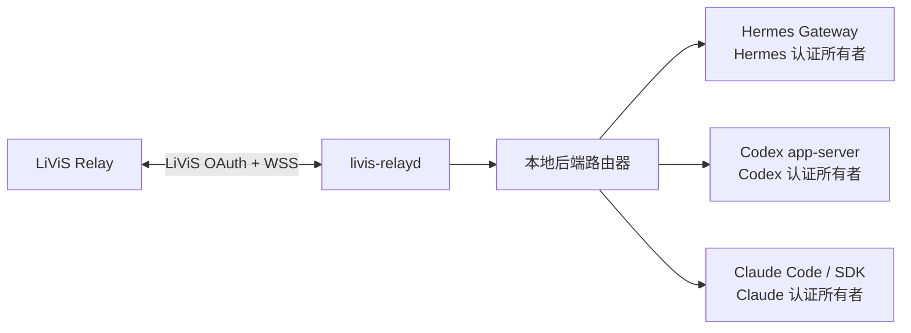

# 本地多后端架构与认证边界

本文定义 `livis-relayd` 调用本机 Hermes、Codex 和 Claude 的当前基线与目标架构。Hermes
connector 已实现；Codex app-server backend 也已实现并取得受控 canary，但当前仍使用 daemon
私有 `CODEX_HOME` 与专用 API key。Claude 才是 `contract-only`。因此“Codex transport 已实现”
与“Codex 已复用用户当前原生认证”必须分开表述，后者尚未完成。

## 1. 目标与非目标

目标是让 daemon 复用本机原生客户端已有的认证状态，只做消息路由、调用和结果持久化：

- Hermes 继续使用自己的 profile、Gateway 和 provider 凭据。
- Codex 由 `codex app-server` 或后续审核通过的等价本地接口执行，并由 Codex 自己持有认证。
- Claude 由 Claude Code 的稳定非交互接口或官方 SDK 执行，并由 Claude Code 自己持有认证。
- 切换后端只改变路由，不触发登录、注销、token 导入或凭据迁移。

非目标：

- 不建立统一的 OpenAI/Anthropic/Hermes 凭据仓库。
- 不把 Codex 或 Claude token 复制到 relay state directory、Hermes profile、SQLite 或配置文件。
- 不允许 LiViS 消息直接指定二进制路径、参数、环境变量或工作目录。
- 不把三个后端的原生 session 文件互相转换或共享。

## 2. 当前实现基线

| 后端 | 调用链 | 当前认证所有权 | 当前状态 |
| --- | --- | --- | --- |
| Hermes | daemon → UDS connector → 专用 Hermes Gateway | Hermes 专用 profile | 已实现；远程输入门禁与 canary 已落地 |
| Codex | daemon → stdio JSON-RPC → `codex app-server` | `<stateDir>/backends/codex/home` 中由 Codex 管理的专用 API key | 已实现、实验性；不是用户日常 Codex 当前登录态 |
| Claude | 尚无 transport | 尚未定义 | `contract-only` |

当前 `execution.backend` 是 daemon 级三选一配置；切换需要停服、排空异 backend 非终态 job
并重启。它不是“同一 daemon 在线同时连接三个后端、每次请求只切路由”的最终形态。

## 3. 目标进程与状态所有权

| 状态 | 唯一所有者 | daemon 允许的操作 | 失败行为 |
| --- | --- | --- | --- |
| LiViS access/refresh token | `livis-relayd` | 获取、刷新、撤销并以 `0600` 保存 | 终止 LiViS 连接并要求操作者重新登录 |
| connector Bearer 与 lease | `livis-relayd` 和已审核 connector | 本机 IPC 鉴权与执行 fencing | 拒绝连接或迟到结果 |
| Hermes provider 认证 | Hermes 原生 profile | 只观察标准化 readiness | `backend_auth_unavailable` |
| Codex 认证 | Codex 原生运行时 | 调用 app-server，不读取或复制 token | `backend_auth_unavailable` |
| Claude 认证 | Claude Code/Keychain | 调用原生接口，不读取 token | `backend_auth_unavailable` |
| 本地 session/thread ID | 对应 backend adapter | 作为不透明引用保存和回传 | 新建会话或失败关闭 |

LiViS OAuth 与本地推理后端认证是两个独立安全域。backend adapter 不得导入 `IdaasClient`
或 `SecretStore`，daemon 也不得把 LiViS token 交给本地后端。这里描述目标 adapter contract；
现有 Codex 的私有 `CODEX_HOME` 是需要迁移的兼容路径，不得被文档隐藏。

## 4. 强制认证边界

daemon 和 backend adapter 必须遵守以下规则：

1. adapter 不读取、解析、复制或监听 Codex、Claude、Hermes 的凭据文件、Keychain 条目或认证环境变量；只允许原生后端进程按其官方机制访问。
2. 不提供 `login`、`logout`、`authenticate`、`getAccessToken` 或 refresh 方法。
3. 不执行原生客户端的登录、注销或 auth 命令。
4. 不通过 argv、环境变量、IPC payload、日志、SQLite 或错误详情传递后端 token。
5. readiness 只允许返回 `ready`、`offline`、`authentication-required` 或 `incompatible`，不能返回账号、token、scope 或 cookie。
6. 收到 `authentication-required` 时只映射为稳定错误 `backend_auth_unavailable`；认证必须由操作者在原生客户端完成。
7. 后端切换不得删除、覆盖或迁移任何后端的现有认证状态。

这些边界由 [`src/backend/contract.ts`](../src/backend/contract.ts)、[`tests/local_backend_contract.test.ts`](../tests/local_backend_contract.test.ts) 和 [`tests/auth_boundary.test.ts`](../tests/auth_boundary.test.ts) 共同约束。契约同时公开当前实现状态与认证集成状态，防止再次把 Codex 误写为 `contract-only`，或把私有 `CODEX_HOME` 误写成原生认证复用。

## 5. 后端中立调用契约

目标 adapter 只暴露三类动作：

- `probe()`：返回实现名称、版本和标准化 readiness。
- `invoke()`：接收 `jobId + leaseId + runGeneration + text + optional session ref`，返回纯文本 final 与本地 session ID。
- `cancel()`：对当前 lease 做 best-effort 取消，不承诺不合作的工具子进程已经退出。

调用 payload 不包含 credential、token、API key、环境变量、命令行或工作目录。二进制路径、固定参数、工作区和资源限制属于操作者审核的本地配置，不来自远端消息。

当前一期 Hermes UDS WebSocket 协议继续运行，不在本阶段改变。后续 adapter 可以使用不同的本机 transport，但进入 daemon 前必须映射到相同的 job、lease、取消和唯一 final 语义。

## 6. 路由与会话

- 后端选择来自操作者批准的本地路由配置，不能由未受信任的消息正文隐式改变。
- 同一个 LiViS session 默认固定一个本地后端和原生 session ID。
- 切换后端默认新建原生 session；若要延续上下文，只能传递经过长度和内容限制的文本摘要。
- 不复制 Codex、Claude 或 Hermes 的原生 session 文件，也不伪造其 session ID。
- backend 断开、取消不确定或结果状态不明时，沿用现有 ambiguous execution 隔离，不自动换后端重跑。
- 自动 fallback 必须单独设计和授权；认证不可用不能静默降级到另一个可能具有不同数据边界的后端。

## 7. 后续开发计划与门禁

### 7.1 当前收口状态

- 契约与离线认证边界已经完成：调用契约不含凭据字段，Codex 实现状态与认证集成状态分开，Claude 明确为 `contract-only`。
- 当前只有 `bun run src/index.ts ...` 和 package script，没有安装后可直接调用的稳定 `livis-relay` / `livis-relayd` bin 入口。
- 当前 `main` 使用 `livis-relay-v1-access-only-r2`，本地 S2 门禁已闭合；最终组合 head 的真实 Relay access-only canary 仍是正式启用阻塞项。
- 旧 `worktree-arch-refactor` 的多 connector/outbox pump 原型假设与当前 JobStore v7、ExecutionBackend 和单 backend 失败关闭边界不同，只能作为设计输入，不能直接 cherry-pick。旧 Hermes 0.18.2 / connector v2 / 远程 `/sethome` 路线同样不得进入当前基线。

建议按下面顺序逐块开发，每块独立提交并在精确 staged tree 上运行 `bun run check`。

### 7.2 Gate 0：access-only 最终 head 验收

这项不阻止纯离线 adapter 开发，但阻止当前版本正式启用 LiViS Relay：

1. 在获授权非生产环境完成 `connect(access-only) → connected`；
2. 完成 `token_expiring → IDaaS refresh → token_refresh(access-only) → token_refreshed`；
3. 刷新后完成一条文本 job、结果 ACK 和断线重连；
4. 回执绑定精确 commit、profile/runtime contract SHA 和字段名集合，不保存 token 或生产标识。

失败时保持 r2 fail closed，不恢复发送 refresh token。

### 7.3 阶段 B：Codex 原生当前认证复用

目标是不复制凭据地复用用户已登录的 Codex，同时保留现有 app-server 执行与安全门禁。

工作包：

1. 用固定 Codex 版本验证是否存在受支持的“认证由原生客户端持有、workspace/config/thread 仍可隔离”的 app-server 或本地服务入口；记录 Desktop、CLI 与 app-server 并发行为。
2. 给 Codex adapter 增加显式认证模式，保留现有 `private-api-key` 兼容路径；新模式只能请求原生 runtime 执行，不能读取、复制、链接或导出默认 `~/.codex`、Keychain 或 `auth.json`。
3. readiness 只返回标准状态和稳定错误分类；账号、token、scope、cookie、原始 provider 错误不进入 daemon 状态、SQLite 或日志。
4. 覆盖未认证、已认证、运行中注销/切换、并发 Desktop/CLI、超时、取消、进程退出、resume、daemon 重启和认证状态漂移。

完成定义：非生产 canary 证明 daemon 未产生第二份后端凭据、日常 Codex 仍可用、job/lease/checkpoint 全闭合，才把 `codex_native_auth_reuse` 从 `unsupported` 升级。若上游把认证和可写 session/config 强耦合，则保持现有私有 API-key 路径并明确标记阻塞，不能用 symlink 或文件复制绕过。

### 7.4 阶段 C：Claude adapter

先做只读协议 PoC，再选择 Claude Code 的稳定非交互接口或官方 SDK；不能先假设 CLI 文本输出就是长期协议。

工作包：

1. 固定版本窗和 transport，定义 initialize/readiness、invoke、唯一 final、session ref、cancel、timeout 与进程收口语义。
2. 只允许 Claude 原生进程访问其 Keychain/凭据；daemon 不执行登录、不接收 API key、不解析凭据文件。
3. 将 Claude 事件映射到现有 job、lease、run generation、append-only attempt ledger 与 ambiguous execution 隔离，不伪装成 Codex JSON-RPC。
4. 覆盖未登录、已登录、运行中注销、超时、取消、崩溃、迟到事件、resume 和版本漂移，再完成受控本机 canary。

完成定义：transport、认证复用和 session 恢复分别有证据后，才将 `claude_execution` 从 `unsupported` 提升；任一缺失都不能因“命令能返回文本”而标为已实现。

### 7.5 阶段 D：稳定本地 CLI 与可观测面

在 adapter 状态字段稳定后提供版本化 `bin` 入口：

- `livis-relay status`、`doctor`、`capabilities`；
- `livis-relay backend list/status`，只显示 implementation、auth integration、readiness、版本和 session affinity；
- `livis-relayd serve` 作为常驻入口，并保持现有 config/profile/guard 语义。

CLI 通过 daemon 管理接口或受 guard 保护的离线只读路径工作，不增加后端 `login/logout` 命令，不输出账号或 token。安装器需要原子替换、版本回读和回滚收据；在此之前继续把 `bun run src/index.ts` 称为开发入口，不能宣称已有稳定 CLI。

### 7.6 阶段 E：在线多后端路由

这是最后一阶段，不与 adapter bring-up 混做：

1. 引入显式 backend registry 和本地 operator-approved route ID；远端消息正文不能选择后端。
2. 新增持久 session affinity 与迁移，job 首次入库仍不可变绑定目标 backend；切换默认新建原生 session。
3. 分离每个 adapter 的 start/ready/stop/recovery，同时保持 JobStore/outbox 只有一个 daemon 所有者。
4. 禁止认证错误自动 fallback；跨后端重跑必须是单独授权的产品语义。
5. 覆盖一个后端失效不误停其他后端、旧代际迟到事件、daemon 重启、积压迁移、取消与 session release。

完成定义：三后端独立离线/本机 canary、认证存储零改写证明和 LiViS 实网路由 canary 均闭合后，才把 `online_multi_backend_routing` 从 `unsupported` 提升。
