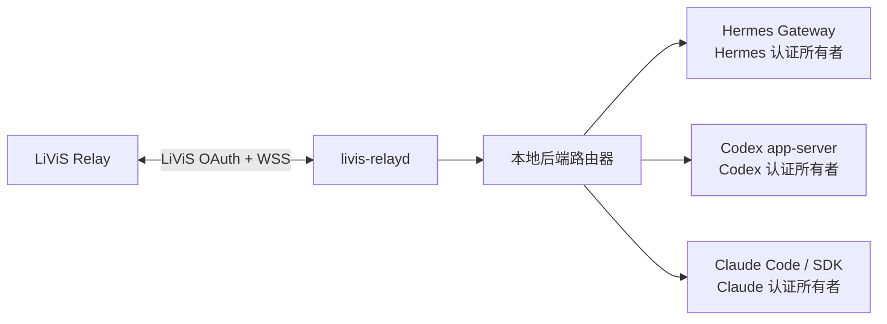

# 本地多后端架构与状态边界

本文定义 `livis-relayd` 调用本机 Hermes、Codex 和 Claude 的当前基线与目标架构。Hermes
connector 已实现；Codex app-server backend 也已实现并取得受控 canary，但当前仍使用 daemon
私有 `CODEX_HOME` 与专用 API key。Claude 才是 `contract-only`。目标原生 adapter 不复用或处理
“认证信息”，而是把本地 backend 的当前状态视为完全不透明：能连接就调用，执行错误就按普通
backend failed 处理。

## 1. 目标与非目标

目标是让 daemon 只做消息路由、调用和结果持久化，不理解本机原生客户端的账号或凭据状态：

- Hermes 继续使用自己的 profile、Gateway 和 provider 凭据。
- Codex 由 `codex app-server` 或后续审核通过的等价本地接口按本地当前状态执行。
- Claude 由 Claude Code 的稳定非交互接口或官方 SDK 按本地当前状态执行。
- 切换后端只改变路由，不触发登录、注销、token 导入或凭据迁移。
- 本地未登录、账号切换或 provider 错误不构成 daemon readiness 门禁；调用失败只结算当前 job。

非目标：

- 不建立统一的 OpenAI/Anthropic/Hermes 凭据仓库。
- 不把 Codex 或 Claude token 复制到 relay state directory、Hermes profile、SQLite 或配置文件。
- 不允许 LiViS 消息直接指定二进制路径、参数、环境变量或工作目录。
- 不把三个后端的原生 session 文件互相转换或共享。

## 2. 当前实现基线

| 后端 | 调用链 | 当前认证所有权 | 当前状态 |
| --- | --- | --- | --- |
| Hermes | daemon → UDS connector → 专用 Hermes Gateway | Hermes 专用 profile | 已实现；远程输入门禁与 canary 已落地 |
| Codex | daemon → stdio JSON-RPC → `codex app-server` | `<stateDir>/backends/codex/home` 中由 Codex 管理的专用 API key | 已实现、实验性；不是用户日常 Codex 当前登录态 |
| Claude | 尚无 transport | 尚未定义 | `contract-only`；`execution.backend=claude` 可被配置解析，但 `serve` 明确失败关闭 |

当前 `execution.backend` 是 daemon 级三选一配置；切换需要停服、排空异 backend 非终态 job
并重启。它不是“同一 daemon 在线同时连接三个后端、每次请求只切路由”的最终形态。

## 3. 目标进程与状态所有权

| 状态 | 唯一所有者 | daemon 允许的操作 | 失败行为 |
| --- | --- | --- | --- |
| LiViS access/refresh token | `livis-relayd` | 获取、刷新、撤销并以 `0600` 保存 | 终止 LiViS 连接并要求操作者重新登录 |
| connector Bearer 与 lease | `livis-relayd` 和已审核 connector | 本机 IPC 鉴权与执行 fencing | 拒绝连接或迟到结果 |
| Hermes 本地运行状态 | Hermes 原生 runtime | 不读取、不分类，直接调用 | 普通 backend failed |
| Codex 本地运行状态 | Codex 原生 runtime | 不读取、不分类，直接调用 | 普通 backend failed |
| Claude 本地运行状态 | Claude Code/SDK | 不读取、不分类，直接调用 | 普通 backend failed |
| 本地 session/thread ID | 对应 backend adapter | 作为不透明引用保存和回传 | 新建会话或失败关闭 |

LiViS OAuth 与本地推理后端认证是两个独立安全域。backend adapter 不得导入 `IdaasClient`
或 `SecretStore`，daemon 也不得把 LiViS token 交给本地后端。这里描述目标 adapter contract；
现有 Codex 的私有 `CODEX_HOME` 是需要迁移的兼容路径，不得被文档隐藏。

## 4. 认证边界与当前门禁强度

daemon 和 backend adapter 必须遵守以下规则：

1. adapter 不读取、解析、复制或监听 Codex、Claude、Hermes 的凭据文件、Keychain 条目或认证环境变量；只允许原生后端进程按其官方机制访问。
2. 不提供 `login`、`logout`、`authenticate`、`getAccessToken` 或 refresh 方法。
3. 不执行原生客户端的登录、注销或 auth 命令。
4. 不通过 argv、环境变量、IPC payload、日志、SQLite 或错误详情传递后端 token。
5. 不调用账号状态接口，不比较主体、登录方式或 provider 认证类型，也不把这些数据写入状态、日志或 SQLite。
6. readiness 只描述 transport：`ready`、`offline` 或 `incompatible`。`ready` 不代表本地执行一定成功。
7. 本地 backend 返回的错误按普通 failed 结算，不识别“认证不可用”，不据此阻止后续调用或隔离 session。
8. 后端切换不得删除、覆盖或迁移任何后端的现有本地状态。

当前代码通过静态声明和源码扫描建立第一层门禁：
[`src/backend/contract.ts`](../src/backend/contract.ts) 公开实现状态、认证集成状态和无凭据的
概念 payload，[`tests/local_backend_contract.test.ts`](../tests/local_backend_contract.test.ts)
检查这些声明；[`tests/auth_boundary.test.ts`](../tests/auth_boundary.test.ts) 扫描
`daemon.ts`、`connector/server.ts` 和 `src/backend(s)`，拒绝已知凭据路径、认证环境变量、
Keychain 读取与登录命令字面量。

这不是完整的运行时强制：`contract.ts` 尚未被生产执行路径导入，源码扫描也不覆盖
`config.ts`、state 等所有数据路径，且不能识别 `process.env` 整体继承之类的间接泄漏。
因此当前门禁只能捕获已枚举的显式越界；在各 adapter 增加专用运行时 guard、环境白名单和
端到端负向测试前，其余边界仍依赖 code review 与实现纪律。不能把测试通过表述为 daemon
已经在运行时强制了全部认证边界。

## 5. 后端中立调用契约

当前 [`src/backend/contract.ts`](../src/backend/contract.ts) 用三类动作表达概念调用面：

- `probe()`：返回实现名称、版本和标准化 readiness。
- `invoke()`：接收 `jobId + leaseId + runGeneration + text + optional session ref`，返回纯文本 final 与本地 session ID。
- `cancel()`：对当前 lease 做 best-effort 取消，不承诺不合作的工具子进程已经退出。

调用 payload 不包含 credential、token、API key、环境变量、命令行或工作目录。二进制路径、固定参数、工作区和资源限制属于操作者审核的本地配置，不来自远端消息。

这里的 `invoke(): Promise<final>` 只是 payload/result 草案，不足以作为生产执行生命周期契约。
生产 adapter 在进入 daemon 前必须映射到现有
[`ExecutionBackend`](../src/backends/execution-backend.ts) 的以下语义：

- dispatch/cancel 返回 `not_sent | submitted`；只有能够证明请求没有离开 daemon 时才允许
  `not_sent`，其余错误一律按已提交或 ambiguous execution 隔离，不能自动重试；
- 独立传递 accepted、唯一 final、failed、cancelled 和 disconnected 事件，不能用一次
  Promise reject 抹平提交后断连；
- 原生当前状态 adapter 不识别 provider 错误是否与账号有关；任意权威 failed 都只原子提交当前
  job 的失败结果并清理 attempt，不设置 `credential_rejected`；
- event handler 只在对应持久化迁移完成后返回，后端 transport 才能 ACK 或释放内存映射。

若未来仍保留 `invoke()` 外形，其稳定错误类型必须显式携带提交状态与 session disposition，
adapter 还必须提供断连事件通道；在这些字段和映射测试落地前，`LocalBackendAdapter` 不能接入
生产派发。当前一期 Hermes UDS WebSocket 协议继续运行，不在本阶段改变；后续 adapter 可以
使用不同本机 transport，但必须保留上述 job、lease、提交可证明性、取消、隔离和唯一 final
语义。

## 6. 路由与会话

- 后端选择来自操作者批准的本地路由配置，不能由未受信任的消息正文隐式改变。
- 同一个 LiViS session 默认固定一个本地后端和原生 session ID。
- 切换后端默认新建原生 session；若要延续上下文，必须由操作者对本次切换或固定路由显式授权，
  才能传递经过长度和内容限制的文本摘要。摘要属于跨后端数据流，不能作为默认能力或静默 fallback。
- 不复制 Codex、Claude 或 Hermes 的原生 session 文件，也不伪造其 session ID。
- backend 断开、取消不确定或结果状态不明时，沿用现有 ambiguous execution 隔离，不自动换后端重跑。
- 自动 fallback 必须单独设计和授权；任何本地 backend 错误都不能静默换后端重跑。

## 7. 后续开发计划与门禁

### 7.1 当前收口状态

- 本地状态不透明的静态声明与离线扫描基线已经完成：概念 payload 不含凭据或账号字段，Codex 实现状态与现有私有认证路径分开，Claude 明确为 `contract-only`。生产 adapter 生命周期契约仍需补齐提交可证明性与断连，不能把声明层视为已完成接线。
- 当前只有 `bun run src/index.ts ...` 和 package script，没有安装后可直接调用的稳定 `livis-relay` / `livis-relayd` bin 入口。
- 当前 `main` 使用 `livis-relay-v1-access-only-r2`，本地 S2 门禁已闭合；最终组合 head 的真实 Relay access-only canary 仍是正式启用阻塞项。
- 旧 `worktree-arch-refactor` 的多 connector/outbox pump 原型假设与当前 JobStore v7、ExecutionBackend 和单 backend 失败关闭边界不同，只能作为设计输入，不能直接 cherry-pick。旧 Hermes 0.18.2 / connector v2 / 远程 `/sethome` 路线同样不得进入当前基线。

建议按下面顺序逐块开发，每块独立提交并在精确 staged tree 上运行 `bun run check`。

### 7.2 Gate 0：access-only 最终 head 验收

这项不阻止纯离线 adapter 开发，但阻止当前版本正式启用 LiViS Relay：

1. 在获授权非生产环境完成 `connect(access-only) → connected`；
2. 完成 `token_expiring → IDaaS refresh → token_refresh(access-only) → token_refreshed`；
3. 刷新后完成一条文本 job、结果 ACK 和断线重连；
4. 回执绑定精确 commit、profile/runtime contract SHA 和字段名集合，不保存 token 或生产标识。

失败时保持 r2 fail closed，不恢复发送 refresh token。

### 7.3 阶段 B：Codex 原生当前状态调用

目标是调用本机已经存在的 Codex runtime，同时让账号、登录方式、凭据和 provider 状态对 relay
完全不透明。relay 不做“认证复用”逻辑；本地是什么状态就按什么状态调用。

首个只读切片已实现：[`codex probe-native-daemon`](./CODEX-NATIVE-AUTH.md) 固定 CLI、核验原生
daemon/app-server 版本与私有 Unix socket，并通过官方 proxy 只完成 initialize。它不读取账号状态，
不会启动或重启原生 daemon，也不会创建 thread；报告始终保持 `productionReady=false`。
2026-07-24 的历史观察中 CLI `0.145.0` 与 app-server `0.144.1` 不一致；本轮离线工作没有重新读取
真实端点。

当前 Codex Desktop 及其原生 daemon 是用户拥有的外部系统。relay 只允许 attach 操作者显式配置、
已经存在且版本兼容的 socket；不得启动、停止、重启、替换或升级 Desktop daemon，不得启用或关闭
remote control，也不得修改 `~/.codex`、默认配置或 Desktop session。不兼容时不能自动回退到
私有 API-key 路径。自动化开发只能使用测试拥有的 fake 端点。

第二个纯离线切片
[`CodexNativeExecutionLifecycle`](../src/backends/codex/native-execution-lifecycle.ts) 把预先建立的 proxy
client 映射到 `not_sent | submitted`、accepted、唯一 final、cancel、timeout、disconnect 与
ambiguous execution 语义。本地 backend 的任意 failed 都按普通、脱敏 failed 结算，不识别账号
状态、不设置 `credential_rejected`，也不因此 quarantine session。

第三个切片 [`native thread policy`](../src/backends/codex/native-thread-policy.ts) 固定 workspace、审批、
permission profile、feature、model/provider、sandbox、memory 和 fresh/resume checkpoint。这些是执行
隔离与结果归属门禁，不是账号门禁；失败时不推断原因是否与本地认证有关。

第四个切片 [`client epoch fence`](../src/backends/codex/native-client-epoch.ts) 每次 fake proxy attach
只分配递增 epoch，不发 RPC、不保存账号或主体绑定。旧 proxy 的迟到 notification、exit 和 timeout
不会结算或断开新 proxy，新 epoch 也不复用旧 active attempt 或 accepted gate。对应
[`epoch 测试`](../tests/codex_native_client_epoch.test.ts) 与
[`生命周期测试`](../tests/codex_native_execution_lifecycle.test.ts) 仍全部使用 fake 端点。

这里仍有一个执行隔离门槛：permission profile 与 feature 集合由原生 daemon 持有。relay 不得通过
修改用户默认配置、重启 Desktop daemon 或关闭用户 feature 来满足门禁；兼容端点必须原生提供不
影响 Desktop 的逐客户端/逐 thread 隔离。做不到就保持 `unsupported`，不能削弱门禁换取接线。

工作包：

1. 实现持久 session coordinator，只组合 epoch、thread/checkpoint、job/lease 与 lifecycle；旧 active
   attempt 必须先结算或进入 ambiguous quarantine，才允许新 epoch 恢复 thread。
2. 原生模式不读取或持久化 account type、主体、登录状态、token、scope 或 provider 认证分类；现有
   `private-api-key` 兼容路径只能由操作者显式选择，不能自动 fallback。
3. readiness 只描述 transport 的 `ready | offline | incompatible`；本地执行错误不降低 transport
   readiness，也不阻止后续 job 再次调用当前本地状态。
4. 用 fake 端点覆盖成功、普通 backend failed、超时、取消、proxy 退出、daemon 被动重启、resume
   和旧 epoch 迟到事件；真实 Desktop/CLI 并发只在另行授权的非生产 canary 中验证。

完成定义：另行授权的非生产 canary 证明 daemon 未产生第二份后端凭据、未读取账号状态、未改变
Codex Desktop 生命周期或状态、日常 Codex 仍可用、job/lease/checkpoint 全闭合，才考虑把
`codex_native_auth_reuse` 从 `unsupported` 升级。现有私有路径不能自动 fallback，也不能用 symlink
或文件复制绕过。

### 7.4 阶段 C：Claude adapter

先做只读协议 PoC，再选择 Claude Code 的稳定非交互接口或官方 SDK；不能先假设 CLI 文本输出就是长期协议。

工作包：

1. 固定版本窗和 transport，定义 initialize/readiness、invoke、唯一 final、session ref、cancel、timeout 与进程收口语义。
2. Claude 本地状态对 daemon 完全不透明：不执行登录、不接收 API key、不解析凭据文件、不调用账号状态接口。
3. 为 Claude 子进程建立独立 runtime layout 和 spawn 环境白名单；禁止整体继承 daemon 的 `process.env`，显式清除 API key、OAuth token 和其他未审核凭据变量，只透传固定的非敏感 locale/terminal 与经审核路径。
4. 将 Claude 事件映射到现有 job、lease、run generation、提交可证明性、append-only attempt ledger 与 disconnect/ambiguous execution 隔离，不识别账号错误，也不伪装成 Codex JSON-RPC。
5. 覆盖成功、普通 backend failed、环境变量污染、超时、取消、崩溃、迟到事件、resume 和版本漂移，再完成受控本机 canary。

完成定义：transport、状态不透明边界和 session 恢复分别有证据后，才将 `claude_execution` 从 `unsupported` 提升；任一缺失都不能因“命令能返回文本”而标为已实现。

### 7.5 阶段 D：稳定本地 CLI 与可观测面

在 adapter 状态字段稳定后提供版本化 `bin` 入口：

- `livis-relay status`、`doctor`、`capabilities`；
- `livis-relay backend list/status`，只显示 implementation、transport readiness、版本和 session affinity；
- `livis-relayd serve` 作为常驻入口，并保持现有 config/profile/guard 语义。

CLI 通过 daemon 管理接口或受 guard 保护的离线只读路径工作，不增加后端 `login/logout` 命令，不输出账号或 token。安装器需要原子替换、版本回读和回滚收据；在此之前继续把 `bun run src/index.ts` 称为开发入口，不能宣称已有稳定 CLI。

### 7.6 阶段 E：在线多后端路由

这是最后一阶段，不与 adapter bring-up 混做：

1. 引入显式 backend registry 和本地 operator-approved route ID；远端消息正文不能选择后端。
2. 新增持久 session affinity 与迁移，job 首次入库仍不可变绑定目标 backend；切换默认新建原生 session。
3. 分离每个 adapter 的 start/ready/stop/recovery，同时保持 JobStore/outbox 只有一个 daemon 所有者。
4. 禁止任何 backend failed 自动 fallback；跨后端重跑必须是单独授权的产品语义。
5. 覆盖一个后端失效不误停其他后端、旧代际迟到事件、daemon 重启、积压迁移、取消与 session release。

完成定义：三后端独立离线/本机 canary、认证存储零改写证明和 LiViS 实网路由 canary 均闭合后，才把 `online_multi_backend_routing` 从 `unsupported` 提升。
